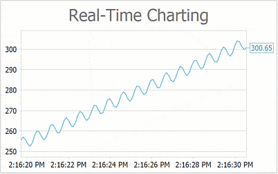

<!-- default badges list -->

<!-- default badges end -->

# Chart for WinForms - Create a Real-Time Chart

The chart processes points that are within its viewport. In this example, points that are beyond the viewport are removed from the data source - starting from the beginning of the collection. 

This example shows how to generate a new data point that is added to the chart each time the [`Timer.Tick`](https://docs.microsoft.com/en-us/dotnet/api/system.windows.forms.timer.tick?view=windowsdesktop-6.0) event occurs (every 100 milliseconds). The example uses an [`ObservableCollection`](https://docs.microsoft.com/en-us/dotnet/api/system.collections.objectmodel.observablecollection-1) as the data source for a [series](https://docs.devexpress.com/WindowsForms/6167/controls-and-libraries/chart-control/chart-elements/series?p=netframework). `ObservableCollection` notifies the chart about new items, and the chart is rendered again.

## Files to Look At

* [Form1.cs](./CS/RealTimeChartUpdates/Form1.cs) (VB: [Form1.vb](./VB/RealTimeChartUpdates/Form1.vb))

## Documentation

* [How to: Create a Real-Time Chart](https://docs.devexpress.com/WindowsForms/401813/controls-and-libraries/chart-control/examples/creating-charts/providing-data/how-to-create-a-real-time-chart)
* [Best Practices: Display Large Data](https://docs.devexpress.com/WindowsForms/119143/controls-and-libraries/chart-control/provide-data/best-practices-display-large-data?p=netframework)

## More Examples

* [How to: Create a Real-Time Chart and Collect Data in a Separate Thread](https://github.com/DevExpress-Examples/xtracharts-how-to-create-a-real-time-chart-and-collect-data-in-a-separate-thread)
